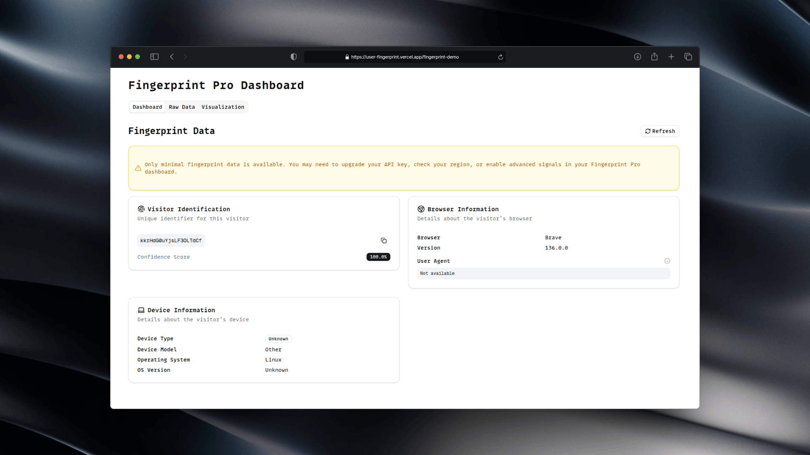

# User Fingerprint

Exploring fingerprinting users in Next.js apps.

This is a full implementation. 

We see extended fingerprinting data when:
- deployed to a custom domain
- verified with a CNAME record
- visitor is not blocking scripts through ad blockers or Brave Shields

See: 

- [fingerprint-demo](https://user-fingerprint.vercel.app/fingerprint-demo)
- [fingerprint-debug](https://user-fingerprint.vercel.app/fingerprint-debug)

Unfortunately, I don't get too much out of FingerprintJS Pro.

## Content

- FingerprintJS Pro
- TanStack Query
- Jotai
- Motion
- Zod
- Biome
- Shadcn with lint fixes according to Biome.

## License

MIT
